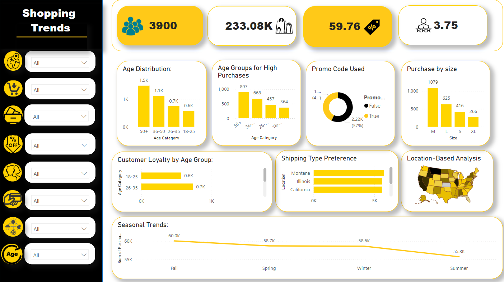

# Customer Shopping Trends Analysis 📊

A comprehensive analysis of customer shopping behavior and preferences using **Power BI**. This project provides actionable insights into customer demographics, product preferences, seasonal trends, and geographical purchasing behavior to aid in data-driven marketing strategies.

---

## 🚀 Project Objectives

- **Understand customer demographics**:
  - Age distribution and customer loyalty.
  - Identify high-value purchase age groups.
  - Analyze gender-based purchase frequency.

- **Analyze product and category trends**:
  - Top categories by revenue.
  - Seasonal purchasing patterns.

- **Geographical analysis**:
  - Map purchase amounts by location.
  - Understand shipping preferences in top-performing regions.

- **Interactive Dashboard**:
  - Enable dynamic filtering by category, location, age, and gender.
  - Provide KPIs for total sales, average purchase amounts, and more.
    

## 📂 Project Structure

```plaintext
📁 customer_shopping_trends_analysis
│
├── dashboard.pbix                #PowerBI Report
├── cleaned_data                  # Cleaned and transformed dataset
├── raw_data                      # Original dataset
├── transformation_steps.md       # Documentation of data cleaning process
├── dax_formulas.md               # List of all DAX formulas used
├── dashboard_screenshot.png      # Screenshot of the final dashboard
└── README.md                     # You're reading it!
```


## ⚡ Key Features

1. **Customer Demographics**:
   - Visualize age distribution and loyalty.
   - Highlight high-value age groups.

2. **Product Insights**:
   - Revenue-driving categories.
   - Seasonal spending patterns.

3. **Geographical Trends**:
   - Location-based purchase analysis.
   - Popular shipping types by top countries.

4. **Interactive Experience**:
   - Dynamic slicers for deep data exploration.
   - KPI visuals for quick performance metrics.

## 📊 Dashboard Preview




## Insights
1. **Age Group Trends**: Customers aged 50+ have the highest purchase frequency.
2. **Seasonal Highlights**: Fall records the highest spending across most categories.
3. **Geographical Insights**: Some states outperform other ones in purchase amounts.
4. **Shipping Preferences**: Express delivery is the most popular option in the top five countries.


## 🛠️ Tools & Skills

- **Power BI**: Data visualization and reporting.
- **DAX**: Advanced data analysis expressions for calculated columns and measures.
- **Data Cleaning**: Column transformation, type adjustments, and filtering.
- **Data Analysis**: Insights generation from diverse metrics.
  

## 📥 Getting Started

### Clone the Repository
```bash
git clone https://github.com/vinabi/customer-shopping-trends-analysis.git

```
---

### 🌟 If you find this project helpful, don’t forget to star the repo! 🌟
